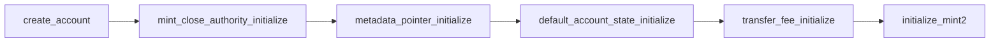

# Token-2022 Remittance Stablecoin Architecture

A production-grade implementation and end-to-end cryptographic test suite demonstrating **Solana Token-2022 (Token Extensions)** for a compliant remittance stablecoin (**RUSD**).

Built using **Anchor v1.2.0**, **Solana ZK SDK v7**, **spl-token-2022**, and tested using high-fidelity local integration testing with **LiteSVM**.

---

## Table of Contents
1. [Overview & Requirements](#overview--requirements)
2. [Task-by-Task Implementation](#task-by-task-implementation)
   - [Task 1: Remittance Mint Initialization](#task-1-remittance-mint-initialization)
   - [Task 2: Dynamic Fee Computation & Transfer](#task-2-dynamic-fee-computation--transfer)
   - [Task 3: StateWithExtensions Deserialization](#task-3-statewithextensions-deserialization)
   - [Task 4: KYC Gating & Targeted Account Thaw](#task-4-kyc-gating--targeted-account-thaw)
   - [Task 5: Re-issued Mint v2 & Extension Combinations](#task-5-re-issued-mint-v2--extension-combinations)
   - [Task 6: End-to-End Confidential Transfer Lifecycle](#task-6-end-to-end-confidential-transfer-lifecycle)
3. [Security Finding: PermanentDelegate vs. Confidential Transfers](#security-finding-permanentdelegate-vs-confidential-transfers)
4. [Account Layouts & Sizing](#account-layouts--sizing)
5. [Building & Running Tests](#building--running-tests)
6. [Repository Structure](#repository-structure)

---

## Overview & Requirements

This system implements an institutional remittance stablecoin designed to satisfy:
- **Issuer Revenue**: Protocol-level transfer fees computed dynamically per epoch.
- **Strict Compliance / KYC**: Default account state is **Frozen**; accounts must pass off-chain KYC before individual thawing.
- **On-chain Trust**: Metadata pointer points directly to the mint itself for tamper-proof resolution.
- **Decommissioning**: Mint close authority allows reclaiming rent if the stablecoin is retired.
- **Law Enforcement & Sanctions**: Permanent delegate allows seizing funds from non-compliant accounts.
- **Privacy & Confidentiality**: Zero-knowledge ElGamal confidential transfers with manual approval policy (`auto_approve_new_accounts = false`).

---

## Task-by-Task Implementation

### Task 1: Remittance Mint Initialization
**Instruction**: `create_remittance_mint` in `programs/t22/src/lib.rs`  
**Test**: `remittance_mint_has_the_complete_task_one_extension_set` in `programs/t22/tests/test_initialize.rs`

Stacks four extensions:
1. `MintCloseAuthority`
2. `MetadataPointer` (pointing to the mint itself)
3. `DefaultAccountState` (`AccountState::Frozen`)
4. `TransferFeeConfig` (basis points + maximum fee)

#### Strict Instruction Ordering
All extension initialization CPIs **must precede `InitializeMint2`**:


Account sizing is calculated using `ExtensionType::try_calculate_account_len::<MintState>(&extensions)`.

---

### Task 2: Dynamic Fee Computation & Transfer
**Instruction**: `transfer_remittance` in `programs/t22/src/lib.rs`  
**Test Suite**: `programs/t22/tests/task2_transfer_fee.rs`

- Reads live `TransferFeeConfig` on-chain using `StateWithExtensions::<MintState>::unpack`.
- Calculates the expected fee dynamically via:
  ```rust
  let current_epoch = Clock::get()?.epoch;
  let expected_fee = fee_config
      .calculate_epoch_fee(current_epoch, amount)
      .ok_or(ProgramError::InvalidArgument)?;
  ```
- Executes `transfer_fee_instruction::transfer_checked_with_fee` passing the dynamic fee.
- **Negative Test**: Verifies that passing a mismatched fee parameter causes Token-2022 to fail with `FeeParametersMismatch` (`0x20`).

---

### Task 3: StateWithExtensions Deserialization
Anchor's `InterfaceAccount<'info, Mint>` deserializes using:
```rust
StateWithExtensions::unpack(buf).map(|t| Mint(t.base))
```
This unpacks the base struct and **discards all extension TLV bytes**. Therefore, all extension-aware reads borrow raw account data and unpack with `StateWithExtensions`:
```rust
let mint_info = ctx.accounts.mint.to_account_info();
let mint_data = mint_info.try_borrow_data()?;
let mint_state = StateWithExtensions::<MintState>::unpack(&mint_data)?;
let fee_config = mint_state.get_extension::<TransferFeeConfig>()?;
```
Zero instances of raw `Mint::unpack` or `Account::unpack` exist in this repository.

---

### Task 4: KYC Gating & Targeted Account Thaw
**Instruction**: `kyc_thaw` in `programs/t22/src/lib.rs`  
**Test Suite**: `programs/t22/tests/task4_kyc_thaw.rs`

- New accounts start `Frozen` by virtue of `DefaultAccountState::Frozen` on the mint.
- Unfreezing an approved account executes `spl_token_2022::instruction::thaw_account` targeting only that specific token account, signed by `freeze_authority`.
- **The Pitfall Avoided**: We explicitly avoid `update_default_account_state`. Calling `update_default_account_state` would change the global default for all future accounts, completely breaking the KYC gate for newly onboarded users.
- Verified by tests:
  1. New account starts frozen and rejects transfers (`AccountFrozen`).
  2. `kyc_thaw` thaws the account and transfers succeed.
  3. A third account created afterwards remains frozen.

---

### Task 5: Re-issued Mint v2 & Extension Combinations
**Instruction**: `create_remittance_mint_v2`, `approve_confidential_account` in `programs/t22/src/lib.rs`  
**Test Suite**: `programs/t22/tests/task5_reissue_mint.rs`

#### The Architectural Gap: Why Re-issuance is Necessary
In Token-2022:
1. Extension initializations are **immutable post-initialization**. Once `InitializeMint2` completes, no new extensions can be appended to the mint.
2. An existing v1 mint cannot dynamically add `PermanentDelegate` or `ConfidentialTransferMint`.
3. Upgrading requires deploying a v2 mint and migrating token balances.

#### Extension Compatibility Rule (`0x33`)
Token-2022 enforces a critical cryptographic rule in `InitializeMint2`:
```rust
if transfer_fee_config && confidential_transfer_mint && !confidential_transfer_fee_config {
    return Err(TokenError::InvalidExtensionCombination); // 0x33
}
```
If a mint supports transfer fees and enables confidential transfers, confidential transactions would bypass fees unless confidential transfer fees are also configured. Therefore, the v2 mint stacks **all 7 required extensions**:
1. `MintCloseAuthority`
2. `PermanentDelegate`
3. `MetadataPointer`
4. `DefaultAccountState`
5. `TransferFeeConfig`
6. `ConfidentialTransferMint` (`auto_approve_new_accounts = false`)
7. `ConfidentialTransferFeeConfig`

#### Manual Approval Policy
Because `auto_approve_new_accounts = false`, accounts that call `ConfigureAccount` start with `approved = false`. The issuer must explicitly invoke `approve_confidential_account` (`ct_ix::approve_account`) before confidential transfers or deposits can proceed.

---

### Task 6: End-to-End Confidential Transfer Lifecycle
**Test Suite**: `programs/t22/tests/confidential.rs` (7 passing tests)

Exercises the complete confidential transfer lifecycle:
1. **Key Derivation**: HKDF-SHA512 derivation of twisted Edwards ElGamal keys and AES decryptable balance keys.
2. **Account Configuration**: `ConfigureAccount` with proof of ElGamal pubkey validity.
3. **Issuer Approval**: `ApproveAccount` (for manual policy).
4. **Deposit**: `DepositConfidentialTokens` moves public tokens into `pending_balance` ciphertext.
5. **Apply Pending**: `ApplyPendingBalance` moves pending ciphertext into `available_balance`.
6. **ZK Proof Generation & Verification**: Range proofs and equality split proofs for confidential transfers.
7. **Withdrawal**: `WithdrawConfidentialTokens` converts available confidential tokens back to public balance.
8. **Encrypted Fee Withholding**: Harvesting encrypted withheld fees to the mint homomorphically.

---

## Security Finding: PermanentDelegate vs. Confidential Transfers

A critical security analysis of the interaction between `PermanentDelegate` and `ConfidentialTransfer`:
- **Core Finding**: A sanctioned account holder can **neutralize** the permanent delegate by moving tokens into the confidential extension (`DepositConfidentialTokens`) before enforcement transactions land.
- Because `PermanentDelegate` only operates on the public `amount` field, once funds become ElGamal ciphertexts in the confidential balance, the permanent delegate cannot seize or move them without the user's private keys.
- **Detailed Writeup**: Read the complete report in [`docs/FINDING_PERMANENT_DELEGATE_VS_CONFIDENTIAL.md`](docs/FINDING_PERMANENT_DELEGATE_VS_CONFIDENTIAL.md).

---

## Account Layouts & Sizing

| Account Type | Extensions Included | Exact Sized Bytes |
| :--- | :--- | :--- |
| **Remittance Mint v1** | `MintCloseAuthority`, `MetadataPointer`, `DefaultAccountState`, `TransferFeeConfig` | `302` bytes |
| **Remittance Mint v2** | + `PermanentDelegate`, `ConfidentialTransferMint`, `ConfidentialTransferFeeConfig` | `548` bytes |
| **Standard Token Account** | `TransferFeeAmount` | `170` bytes |
| **Confidential Fee Token Account** | `TransferFeeAmount`, `ConfidentialTransferAccount`, `ConfidentialTransferFeeAmount` | `545` bytes |

---

## Building & Running Tests

### Prerequisites
- Rust 1.79+ / Solana toolchain
- `cargo-build-sbf`

### 1. Build Program Binary
```bash
cargo build-sbf
```

### 2. Run All Tests
```bash
cargo test
```

### 3. Run Specific Task Tests
```bash
# Task 1 & Mint Sizing Tests
cargo test --test test_initialize

# Task 2 Transfer Fee Tests
cargo test --test task2_transfer_fee

# Task 4 KYC Gating & Thaw Tests
cargo test --test task4_kyc_thaw

# Task 5 Re-issued Mint v2 & Approval Tests
cargo test --test task5_reissue_mint

# Task 6 Confidential Transfer Lifecycle Tests
cargo test --test confidential

# Authority & CPI Guard Tests
cargo test --test authority
```

---

## Repository Structure

```
├── docs/
│   └── FINDING_PERMANENT_DELEGATE_VS_CONFIDENTIAL.md   # Security analysis of PermanentDelegate vs CT
├── programs/
│   └── t22/
│       ├── src/
│       │   ├── lib.rs                                  # Core Anchor program instructions & handlers
│       │   ├── harvest_before_withdraw.md              # Deep dive on fee harvest-before-withdraw
│       │   └── token_22_confiden_transfer.md           # Confidential transfer notes
│       └── tests/
│           ├── test_initialize.rs                      # Task 1: 4-extension mint initialization
│           ├── task2_transfer_fee.rs                   # Task 2: transfer_checked_with_fee tests
│           ├── task4_kyc_thaw.rs                       # Task 4: KYC frozen default & targeted thaw
│           ├── task5_reissue_mint.rs                   # Task 5: 6+ extension v2 mint & manual approve
│           ├── confidential.rs                         # Task 6: Full confidential lifecycle & ZK proofs
│           └── authority.rs                            # Permanent delegate seizure & CPI guard
├── Anchor.toml
├── Cargo.toml
└── README.md
```