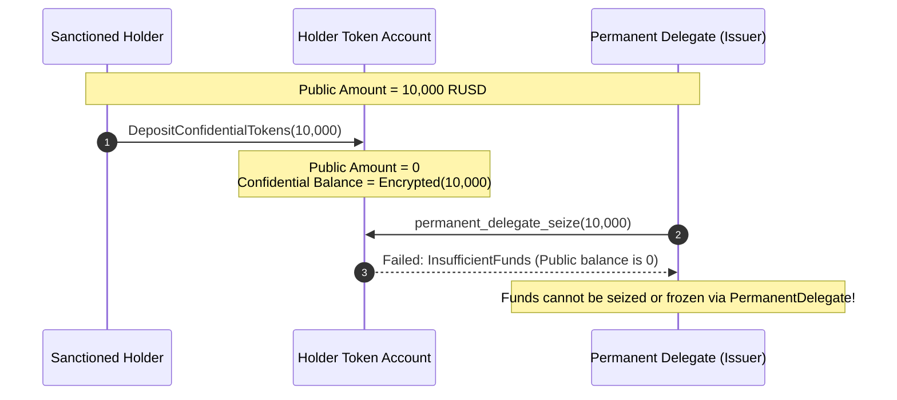

# Security Finding: Neutralization of PermanentDelegate via Confidential Transfers

## Overview

In Solana Token-2022 (Token Extensions), two powerful features frequently co-exist in enterprise and stablecoin designs:
1. **`PermanentDelegate`**: Enables a designated compliance or enforcement authority to transfer or burn tokens from any token account without the account owner's signature or consent.
2. **`ConfidentialTransfer`**: Enables accounts to conceal transfer balances and amounts using ElGamal encryption and zero-knowledge (twisted Edwards Curve25519) range and ciphertext validity proofs.

When these two extensions are combined, a critical security and compliance interaction arises: **a user can neutralize the permanent delegate by depositing tokens into the confidential extension before enforcement actions are executed.**

---

## Technical Analysis of the Vulnerability

### 1. Mechanism of PermanentDelegate
The `PermanentDelegate` extension modifies the transfer logic in the Token-2022 program. When processing `Transfer` or `TransferChecked` instructions, Token-2022 checks whether the transaction signer matches the mint's `permanent_delegate`. If it does, the signature check against the token account `owner` or `delegate` is bypassed, allowing tokens to be debited from the account's public `amount` field.

Critically:
- `PermanentDelegate` operates **exclusively** on the SPL Token base balance (`spl_token_2022::state::Account::amount`).
- It has no authority or interface to interact with TLV extension state.

### 2. Mechanism of Confidential Deposits
When a holder converts public tokens into confidential tokens:
1. The user invokes `DepositConfidentialTokens`.
2. Token-2022 debits the user's public `amount` by `D` and credits `D` as an encrypted ElGamal ciphertext to `pending_balance_lo` and `pending_balance_hi`.
3. The user invokes `ApplyPendingBalance` to fold the pending balance into `available_balance`.
4. At this point:
   - `public amount = 0`
   - `confidential available balance = Enc_user(D)`

### 3. The Neutralization Attack Vector
Suppose a compliance officer or issuer identifies a sanctioned or malicious address and intends to seize funds using `PermanentDelegate`:
1. The sanctioned user detects impending seizure (or proactively as part of routine fund parking).
2. The user submits a `DepositConfidentialTokens` transaction.
3. The user's public `amount` immediately drops to zero.
4. When the compliance authority subsequently calls `permanent_delegate_seize` (`transfer_checked` signed by the permanent delegate), the instruction attempts to transfer from the public balance. Because the public balance is zero, the seizure transaction either fails or extracts zero tokens.
5. The permanent delegate **cannot** invoke `Transfer` on the confidential extension because:
   - Confidential transfers require cryptographic ZK split/equality proofs that can only be constructed using the account holder's private ElGamal key and decryptable balance key (`AeKey`).
   - Token-2022 provides no instruction equivalent to `confidential_transfer_with_permanent_delegate`.

---

## Protocol Remediation & Architectural Defense

To prevent users from circumventing compliance and seizure mechanisms via confidential transfers, issuers must employ multi-layered controls:

### 1. Manual Confidential Approval Policy (`auto_approve_new_accounts = false`)
As implemented in **Task 5 (Remittance Mint v2)**, the mint must be created with `auto_approve_new_accounts = false`.
- Any user who calls `ConfigureAccount` starts in an unapproved state (`approved = false`).
- A user cannot deposit or transfer confidential tokens until the issuer explicitly submits an `ApproveAccount` (`approve_confidential_account`) instruction.
- The issuer only grants confidential approval to accounts that have completed enhanced institutional KYC and sanctions vetting.

### 2. Freeze Authority Gating (`DefaultAccountState::Frozen` & `FreezeAccount`)
- The mint should maintain `DefaultAccountState::Frozen` so accounts cannot interact with the mint without individual clearance (`thaw_account`).
- If suspicious activity is detected, the freeze authority must issue `FreezeAccount` immediately. A frozen account is prohibited from executing both public transfers and confidential deposits.

### 3. Compliance Auditor Key
When initializing `ConfidentialTransferMint`, the issuer can configure an `auditor_elgamal_pubkey`. While the auditor cannot unilaterally move confidential tokens without the owner's private keys, all confidential transfers must create a ciphertext encrypted under the auditor's ElGamal key, ensuring total transaction visibility and eliminating regulatory blind spots.